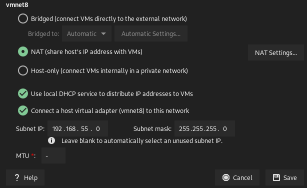

# DDOS Detection using Machine Learning with Different ML Algorithms

## Project Description

The goal of this project is to detect DDoS attacks using machine learning algorithms. The project is divided into three
parts. The first part is to generate benign traffic and DDoS traffic using Mininet. The second part is to collect the
traffic data and store it in a CSV file. The third part is to train the machine learning algorithms and detect the DDoS
attacks.
6 Different Machine Learning Algorithms are used to detect the DDoS attacks. The algorithms are Decision Tree, K-Nearest
Neighbors, Logistic Regression, Naive Bayes, Random Forest, and Support Vector Machine. The accuracy of the algorithms
is compared and the best algorithm is selected.
`Decision Tree`, `K-Nearest Neighbors`, `Logistic Regression`, `Naive Bayes`, `Random Forest` can detect ddos attack
correctly. `Support Vector Machine` can not detect ddos attack correctly. Reason can be the dataset that we are using is
not linearly separable. So, we can not use SVM to detect ddos attack.

### There is 4 main folder in project ;

1. `mininet` folder contains the python scripts to generate benign traffic and DDoS traffic using Mininet.
2. `controller` folder contains the python scripts to collect the traffic data and store it in a CSV file. It also
   contains the python scripts to train the machine learning algorithms and detect the DDoS attacks.
3. `webserver` folder contains the index.html file and test.zip file. The index.html and test.zip files are used to
   generate the benign traffic and DDoS traffic using Mininet.
4. `ml` folder contains the python scripts to train the machine learning algorithms and detect the DDoS attacks.

* The data used to train the machine learning algorithms is stored in the `data` folder in the `controller`
  folder. `controller/data/FlowStatsfile.csv` is dataset for training the machine learning algorithms.
* `controller/data/PredictFlowStatsfile.csv` is dataset for testing the machine learning algorithms. We collect the
  traffic data for 10 seconds and store it in the `PredictFlowStatsfile.csv` file. Then we use
  the `PredictFlowStatsfile.csv` file to test the machine learning algorithms.
* The trained machine learning algorithms are stored in the `ml/TrainedModels` folder.
* The trained machine learning algorithms are loaded in the `controller` folder and used to detect the DDoS attacks.
* The `controller` folder contains the python scripts to train the machine learning algorithms and detect the DDoS
  attacks. The python scripts
  are `DT_controller.py`, `KNN_controller.py`, `LR_controller.py`, `NB_controller.py`, `RF_controller.py`,
  and `SVM_controller.py`. The python scripts are used to train the machine learning algorithms and detect the DDoS
  attacks.
*

# Project  Structure

```text
.
├── controller
│   ├── collect_benign_ddos_trafic.py
│   ├── data
│   │   ├── FlowStatsfile.csv
│   │   └── PredictFlowStatsfile.csv
│   ├── DT_controller.py
│   ├── KNN_controller.py
│   ├── LR_controller.py
│   ├── NB_controller.py
│   ├── __pycache__
│   ├── RF_controller.py
│   ├── SVM_controller.py
│   └── switch.py
├── images
│   ├── cm_allml.png
│   ├── cm_dt2.png
│   ├── cm_dt.png
│   ├── cm_knn2.png
│   ├── cm_knn.png
│   ├── cm_lr2.png
│   ├── cm_lr.png
│   ├── cm_nb2.png
│   ├── cm_nb.png
│   ├── cm_rf2.png
│   ├── cm_rf.png
│   ├── cm_svm2.png
│   ├── cm_svm.png
│   ├── dataset2.png
│   ├── dataset.png
│   ├── dataset_protocol2.png
│   ├── dataset_protocol.png
│   ├── img.png
│   ├── protocol2.png
│   └── protocol.png
├── mininet
│   ├── generate_benign_trafic.py
│   ├── generate_ddos_trafic.py
│   └── topology.py
├── ml
│   ├── DT.py
│   ├── KNN.py
│   ├── LR.py
│   ├── ML.py
│   ├── NB.py
│   ├── RF.py
│   ├── SVM.py
│   └── TrainedModels
│       ├── dt_model.pkl
│       ├── knn_model.pkl
│       ├── lr_model.pkl
│       ├── nb_model.pkl
│       ├── rf_model.pkl
│       └── svm_model.pkl
├── README.MD
├── requirements.txt
└── webserver
    ├── index.html
    └── test.zip

9 directories, 50 files

```

* `controller/collect_benign_ddos_trafic.py` is used to collect the traffic data and store it in a CSV file. and label
  the data as benign or ddos.
* `controller/DT_controller.py` is used to train the Decision Tree algorithm and detect the DDoS attacks.
* `controller/KNN_controller.py` is used to train the K-Nearest Neighbors algorithm and detect the DDoS attacks.
* `controller/LR_controller.py` is used to train the Logistic Regression algorithm and detect the DDoS attacks.
* `controller/NB_controller.py` is used to train the Naive Bayes algorithm and detect the DDoS attacks.
* `controller/RF_controller.py` is used to train the Random Forest algorithm and detect the DDoS attacks.
* `controller/SVM_controller.py` is used to train the Support Vector Machine algorithm and detect the DDoS attacks.
* `controller/switch.py` is used to create openflow switch.
* `controller/data/FlowStatsfile.csv` is dataset for training the machine learning algorithms.
* `controller/data/PredictFlowStatsfile.csv` is dataset for testing the machine learning algorithms.
* `mininet/generate_benign_trafic.py` is used to generate benign traffic using Mininet.
* `mininet/generate_ddos_trafic.py` is used to generate DDoS traffic using Mininet.
* `mininet/topology.py` is used to create the topology.
* `ml/DT.py` is used to train the Decision Tree algorithm.
* `ml/KNN.py` is used to train the K-Nearest Neighbors algorithm.
* `ml/LR.py` is used to train the Logistic Regression algorithm.
* `ml/NB.py` is used to train the Naive Bayes algorithm.
* `ml/RF.py` is used to train the Random Forest algorithm.
* `ml/SVM.py` is used to train the Support Vector Machine algorithm.
* `ml/TrainedModels` is used to store the trained machine learning algorithms.

# How to install Requirements

1. pip install -r requirements.txt
2. To load the trained machine learning algorithms, if you don't want to get error use joblib 1.2.0 version. To learn
   version of joblib use `pip3 show joblib` command.

# How to collect the traffic data

1. Run `controller/collect_benign_ddos_trafic.py` python script. This python script is used to collect the traffic data
   and store it in a CSV file. and label the data as benign or ddos.
   * `RYU_ARG=norm ryu-manager collect_benign_ddos_trafic.py` to collect benign traffic data. it will label the data as
     benign(0).
   * `RYU_ARG=ddos ryu-manager collect_benign_ddos_trafic.py` to collect DDoS traffic data. it will label the data as
     DDoS(1).
2. Run `mininet/generate_benign_trafic.py` python script. This python script is used to generate benign traffic using
   Mininet.
   * `sudo python3 generate_benign_trafic.py` to generate benign traffic.
3. Run `mininet/generate_ddos_trafic.py` python script. This python script is used to generate DDoS traffic using
   Mininet.
   * `sudo python3 generate_ddos_trafic.py` to generate DDoS traffic.
4. After collecting the traffic data, the data is stored in the `controller/data/FlowStatsfile.csv` file. This file can
   be used to train the machine learning algorithms.

# How to train the machine learning algorithms

1. Run `ml/DT.py` python script. This python script is used to train the Decision Tree algorithm.
   * `python3 DT.py` to train the Decision Tree algorithm.
   * 
2. Run `ml/KNN.py` python script. This python script is used to train the K-Nearest Neighbors algorithm.
   * `python3 KNN.py` to train the K-Nearest Neighbors algorithm.
3. Run `ml/LR.py` python script. This python script is used to train the Logistic Regression algorithm.
   * `python3 LR.py` to train the Logistic Regression algorithm.
4. Run `ml/NB.py` python script. This python script is used to train the Naive Bayes algorithm.
   * `python3 NB.py` to train the Naive Bayes algorithm.
5. Run `ml/RF.py` python script. This python script is used to train the Random Forest algorithm.
   * `python3 RF.py` to train the Random Forest algorithm.
6. Run `ml/SVM.py` python script. This python script is used to train the Support Vector Machine algorithm.
   * `python3 SVM.py` to train the Support Vector Machine algorithm.
7. Run `ml/ML.py` python script. This python script is used to train all the machine learning algorithms.
   * `python3 ML.py` to train all the machine learning algorithms.

# How to detect the DDoS attacks

1. Run any machine learning controller with `RYU_ARG=load` or `RYU_ARG=train` , RYU_ARG=load is used to load trained
   model and use this model to check if the traffic is DDoS or not. RYU_ARG=train is used to train the machine learning
   algorithms and use this model to check if the traffic is DDoS or not.
   * `RYU_ARG=load ryu-manager DT_controller.py` to load the Decision Tree algorithm and detect the DDoS attacks.
   * `RYU_ARG=load ryu-manager KNN_controller.py` to load the K-Nearest Neighbors algorithm and detect the DDoS
     attacks.
   * `RYU_ARG=load ryu-manager LR_controller.py` to load the Logistic Regression algorithm and detect the DDoS attacks.
   * `RYU_ARG=load ryu-manager NB_controller.py` to load the Naive Bayes algorithm and detect the DDoS attacks.
   * `RYU_ARG=load ryu-manager RF_controller.py` to load the Random Forest algorithm and detect the DDoS attacks.
   * `RYU_ARG=load ryu-manager SVM_controller.py` to load the Support Vector Machine algorithm and detect the DDoS
     attacks.
   * `RYU_ARG=train ryu-manager DT_controller.py` to train the Decision Tree algorithm and detect the DDoS attacks.
   * `RYU_ARG=train ryu-manager KNN_controller.py` to train the K-Nearest Neighbors algorithm and detect the DDoS
     attacks.
   * `RYU_ARG=train ryu-manager LR_controller.py` to train the Logistic Regression algorithm and detect the DDoS
     attacks.
   * `RYU_ARG=train ryu-manager NB_controller.py` to train the Naive Bayes algorithm and detect the DDoS attacks.
   * `RYU_ARG=train ryu-manager RF_controller.py` to train the Random Forest algorithm and detect the DDoS attacks.
   * `RYU_ARG=train ryu-manager SVM_controller.py` to train the Support Vector Machine algorithm and detect the DDoS
     attacks.
2. Run `mininet/topology.py` python script. This python script is used to create the topology.
   * `sudo -E python topology.py` to create the topology.
   * after creating the topology you can generate traffic with ping , hping3 , iperf , etc.

    
# Graphs of the machine learning algorithms
1. `Decision Tree`
   * |         Confusion Matrix         |          Confusion Matrix          |
     |:--------------------------------:|:----------------------------------:|
     |  |  |
   
2. `K-Nearest Neighbors`
   * |             Confusion Matrix             |              Confusion Matrix              |
     |:----------------------------------------:|:------------------------------------------:|
     |        |        |
   
3. `Linear Regression`
   * |             Confusion Matrix             |              Confusion Matrix              |
     |:----------------------------------------:|:------------------------------------------:|
     |          |          |

4. `Naive Bayes`
   * |             Confusion Matrix             |              Confusion Matrix              |
     |:----------------------------------------:|:------------------------------------------:|
     |          |          |

5. `Random Forest`
   * |             Confusion Matrix             |              Confusion Matrix              |
     |:----------------------------------------:|:------------------------------------------:|
     |          |          |

6. `Support Vector Machine`
   * |             Confusion Matrix             |              Confusion Matrix              |
     |:----------------------------------------:|:------------------------------------------:|
     |        |        |

7. `All ML Algorithms`
   * |           Confusion Matrix           |
     |:------------------------------------:|
     |  |
# Graph of dataset and Protocol
1. `Dataset`
   * |             Dataset             |              Dataset              |
     |:-------------------------------:|:---------------------------------:|
     |  |  |
2. `Protocol`
   * |             Protocol             |              Protocol              |
     |:--------------------------------:|:----------------------------------:|
     |  |  |

3. `Dataset and Protocol`
   * |             Dataset and Protocol             |              Dataset and Protocol              |
     |:--------------------------------------------:|:----------------------------------------------:|
     |  |  |


# Usage of scripts

### Generating benign traffic

1. in mininet vm run `sudo python generate_benign_trafic.py`
2. in controller vm run `RYU_ARG=norm ryu-manager collect_benign_ddos_trafic.py`

### Generating DDoS traffic

1. in mininet vm run `sudo python generate_ddos_trafic.py`
2. in controller vm run `RYU_ARG=ddos ryu-manager collect_benign_ddos_trafic.py`

### Detecting legitimate traffic

1. in controller vm run `RYU_ARG=load ryu-manager DT_controller.py` or any other controller.
2. in mininet vm run `sudo -E python topology.py`
3. `xterm h1 h6 h13 h17` to open xterm for each host. `don't forget to add -X parameter when you ssh to mininet vm`
4. in h1 xterm run `python3 -m http.server 80`
5. in h6 xterm run `wget 10.0.0.1/test.zip`
6. in h13 xterm run `ping 10.0.0.15`
7. in h17 xterm run `ping 10.0.0.4`

### Detecting ICMP flood DDoS traffic

1. in controller vm run `RYU_ARG=load ryu-manager DT_controller.py` or any other controller.
2. in mininet vm run `sudo -E python topology.py`
3. run `xterm h3` to open xterm for each host. `don't forget to add -X parameter when you ssh to mininet vm`
4. in h3 run ```hping3 -1 -V -d 120 -w 64 -p 80 --rand-source --flood 10.0.0.12```

### Detecting TCP SYN flood DDoS traffic

1. in controller vm run `RYU_ARG=load ryu-manager DT_controller.py` or any other controller.
2. in mininet vm run `sudo -E python topology.py`
3. run `xterm h3` to open xterm for each host. `don't forget to add -X parameter when you ssh to mininet vm`
4. in h3 xterm run ```hping3 -1 -S -V -d 120 -w 64 -p 80 --rand-source --flood 10.0.0.1```

### Detecting UDP flood DDoS traffic

1. in controller vm run `RYU_ARG=load ryu-manager DT_controller.py` or any other controller.
2. in mininet vm run `sudo -E python topology.py`
3. run `xterm h3` to open xterm for each host. `don't forget to add -X parameter when you ssh to mininet vm`
4. in h3 xterm run ```hping3 -2 -V -d 120 -w 64 -p 80 --rand-source --flood 10.0.0.7```

### Detecting Smurf Attack DDoS traffic

1. in controller vm run `RYU_ARG=load ryu-manager DT_controller.py` or any other controller.
2. in mininet vm run `sudo -E python topology.py`
3. run `xterm h3` to open xterm for each host. `don't forget to add -X parameter when you ssh to mininet vm`
4. in h3 xterm run ```hping3 -1 -V -d 120 -w 64 --rand-source --flood -a 10.0.0.17 10.0.0.17```

## Notes

1. mininet and ryu controller should be in the same network.
2. mininet and ryu controller has static ip address.
   * mininet ip : 192.168.55.139
   * ryu ip : 192.168.55.138
3. mininet vm username:password is `mininet:mininet`
4. ryu vm username:password is `ryu:ryu`

## Error and solution

1. if you get error when you run xterm , you need to ssh with -X parameter. example `ssh -X root@mininet-vm-ip`
2. to run vm create a new network adapter and set gateway to 192.168.55.0 and subnet mask to 255.255.255.0
   
3. if you get error when you run controller if error about eventlet , you need to install eventlet with this
   version `pip install eventlet==0.30.2`
4. example of `/etc/network/interfaces` file

```text
mininet@debian-mininet:~$ cat /etc/network/interfaces
# This file describes the network interfaces available on your system
# and how to activate them. For more information, see interfaces(5).

source /etc/network/interfaces.d/*

# The loopback network interface
auto lo
iface lo inet loopback

# The primary network interface
#allow-hotplug ens33
#iface ens33 inet dhcp
auto ens33
iface ens33 inet static
address 192.168.55.139
netmask 255.255.255.0
gateway 192.168.55.2
```

### VM links , To use vm you need to download and install VMWare Workstation Player
1. `Mininet VM:` https://mega.nz/file/arpwHBqB#kJgaweO0KtrvA5E5IiEnEv9InXYEPN33U24OHMwJLEw
2. `Ryu VM :` https://mega.nz/file/L6xVTJyJ#IDXeAqDNM_Mo62jUuAgWD4zj--WyJS41_pdjeLPJHSo
# Known issues

1. SVM algorithm is not working properly.

# Reference:

1. https://github.com/dz43developer/sdn-network-ddos-detection-using-machine-learning
2. 